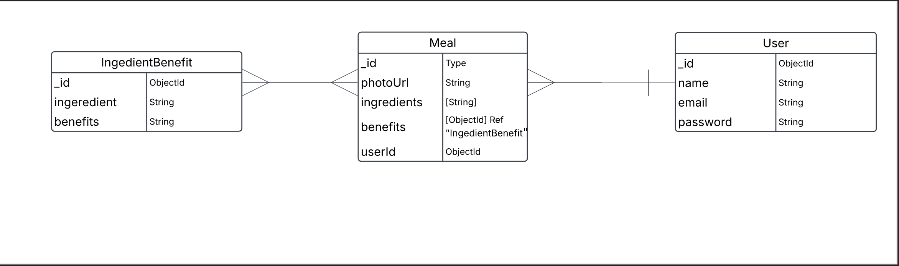

# Rooted – Meal Logging & Ingredient Benefits App

## Project Description

**Rooted** is a wellness-focused web application that helps users build healthy habits/ reconnect with their food source by logging meals and discovering the health benefits of the ingredients they consume. Users can upload a photo of their meal, list ingredients, and receive feedback on how their food supports wellness goals like digestion, skin health, and energy. *Food as medicine vibes

## Wire Frames:

## ERD:

## User Stories

### MVP Goals  
As a user, I want:
- to sign up and log in, so that I can securely save my meal entries.
- to upload a photo of my food, so that I can visually track what I eat.
- to list the ingredients I used in the meal.
- to receive health benefits associated with the ingredients I entered.
- to view all of my previously logged meals.
- to view the details of a single meal.
- to edit or delete only the meals I created.
- to be blocked from any CRUD functionality unless I’m logged in.

### Stretch Goals  
As a user, I want:
- to track how often I eat healthy meals.
- to earn stars, streaks, or XP for consistent logging.
- to receive personalized challenges
- to share meals and follow other users.
- to receive weekly food suggestions based on my goals.

##  Routing Table

###  Authentication Routes

| HTTP Method | Route       | Description                   | Controller Action           | Auth Required? |
|-------------|-------------|-------------------------------|-----------------------------|----------------|
| GET         | `/`         | Home or redirect to login     | `homeController.index`      | no              |
| GET         | `/signup`   | Show signup form              | `authController.signupForm` | no              |
| POST        | `/signup`   | Handle user registration      | `authController.signup`     | no              |
| GET         | `/login`    | Show login form               | `authController.loginForm`  | no              |
| POST        | `/login`    | Handle user login             | `authController.login`      | no              |
| GET         | `/logout`   | Log user out                  | `authController.logout`     | yes              |

---

###  Meal Routes

| HTTP Method | Route             | Description                            | Controller Action        | Auth Required? |
|-------------|------------------|----------------------------------------|---------------------------|----------------|
| GET         | `/meals`         | Show all meals for the logged-in user  | `mealsController.index`   | yes              |
| GET         | `/meals/new`     | Show form to add a new meal            | `mealsController.new`     | yes              |
| POST        | `/meals`         | Create a new meal                      | `mealsController.create`  | yes              |
| GET         | `/meals/:id`     | Show details of one meal               | `mealsController.show`    | yes              |
| GET         | `/meals/:id/edit`| Show form to edit a meal               | `mealsController.edit`    | yes              |
| PUT         | `/meals/:id`     | Update a meal                          | `mealsController.update`  | yes              |
| DELETE      | `/meals/:id`     | Delete a meal                          | `mealsController.delete`  | yes              |

---

## Timeline

| Day       | Task                                           | Blockers | Notes/Thoughts                  |
|-----------|------------------------------------------------|----------|---------------------------------|
| Monday    | Create and present proposal                    | None     | Finalize ERD, wireframes        |
| Tuesday   | Set up GitHub repo and base file structure     | None     | Initialize Express/EJS/MongoDB |
| Wednesday | Build authentication and user routes           | None     | Test login/logout               |
| Thursday  | Implement meal model and CRUD functionality    | None     | Include image and ingredient input |
| Friday    | Add styling and ensure responsive layout       | None     | Use Flexbox / Grid              |
| Saturday  | Finalize MVP, test deployment                  | None     |                                 |
| Sunday    | Work on stretch goals, polish UI               | None     |                                 |
| Monday    | Presentation Day                               | None     |                                 |

## Additional Planning Requirements

- The app will use CSS Grid/Flexbox for responsive layout.
- Meal data will be stored in MongoDB, using Mongoose for schema management.
- All views will be rendered with EJS templates.
- User authentication will be session-based using express-session and bcrypt.
- The app will follow RESTful routing conventions and MVC structure.
- Only authenticated users can view, add, edit, or delete meals.
- The app will be deployed using Render or Heroku.

